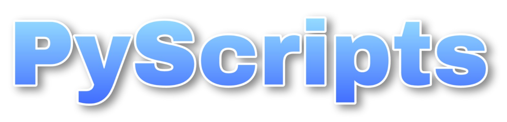

 

## 📌 Introduction

A collection of some great **Python** scripts from basic to advance levels for automating some monotonous tasks.This project contains 3 folders:
 - __TODO Scripts__ (Basic Python Scripts for beginners)
 - __Advanced Scripts__ (Automated and GUI based Python Projects)
 - __EXE Files__ (Contains .exe files for GUI python programs)

This project is for newbies and rookies; who are new to the idea of Open Source contributions but want to be an Open Source Contributor with [**Synthax**](https://synthax.live), to advance coders; who have prolific knowledge in __Open Source Contribution__.

##  💥 How to Contribute?
- All contributions are welcomed. Follow these __[Guidelines](Contribution.md)__ to contribute in this open source project.
- Take a look at __[Guidelines](Contribution.md)__.

## ⚡ Contributors
All *Contributions* of the *Contributors* can be found in the __[Contributions](https://github.com/subhayu99/PyScripts/graphs/contributors)__ section and all details about *Contributors* can be found in [__Contributors.md__](https://github.com/subhayu99/PyScripts/blob/master/Contributors.md) file.

 
<table>
  <tr>
		<td align="center">
          <a href="https://github.com/subhayu99">
               
              
                  <b>
                      <strong>Subhayu Kumar Bala</strong>
                  </b>
              
          </a>
      </td>
      <td align="center">
          <a href="https://github.com/DeepNinja07x">
               
              
                  <b>
                      <strong>Deepraj Rakshit</strong>
                  </b>
              
          </a>
      </td>
    <td align="center">
          <a href="https://github.com/shalini-kumari2000">
               
              
                  <b>
                      <strong>Shalini Kumari</strong>
                  </b>
              
          </a>
      </td>
    <td align="center">
          <a href="https://github.com/Pixmew">
               
              
                  <b>
                      <strong>Yash Shete</strong>
                  </b>
              
          </a>
      </td>
    <td align="center">
          <a href="https://github.com/prathimacode-hub">
               
              
                  <b>
                      <strong>Prathima Kadari</strong>
                  </b>
              
          </a>
      </td>

  </tr>
</table>
